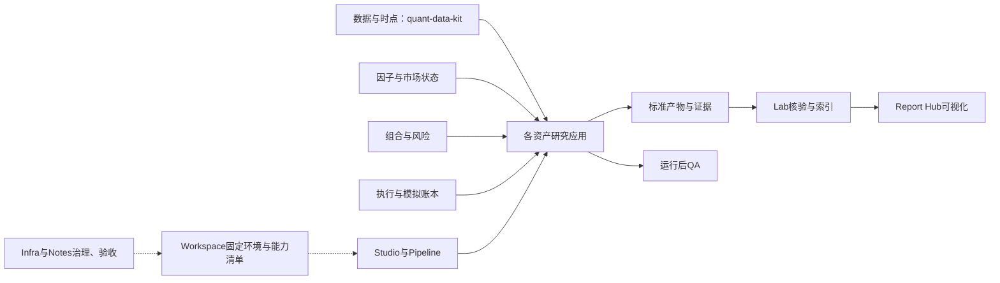

# 量化平台进展与本轮交付

截至2026-10-04，平台已具备分层研究、模拟会计、实验索引和报告消费能力，维护范围为23仓。工程验收明显领先于真实业务数据和策略有效性证明：既有M8发行覆盖14仓，市场数据GA仍未通过；新增应用和新主线提交不继承旧发行认证。

本轮目标“完成全部P0—P2”仍在进行中，[逐项验收清单](PLAN.md)是当前状态依据。软件修复、真实数据闭环、策略有效性和自然前向观察分别签收。

2026-10-06当前工作范围按用户最新方向收敛为[低频研究平台维护](LOW_FREQUENCY_MAINTENANCE.md)：重点为界面与操作体验、时间及账本一致性、跨仓兼容与运行维护。暂不主动新增研究和前向，完整纳秒贯通列为可选兼容工作；下方历史交付记录保留。

2026-10-06第二批软件已实现并推送：基金逐日重放对账与请求重试一致性、模拟盘只读核验与独立备份恢复、Studio原生账本核验及中断记录诊断。全量本地分别81/171/230项通过，跨仓实际命令集成通过；固定提交、远端CI与恢复边界见上述维护页。PR尚未合并主线，不将软件完成扩展为全部旧P0—P2或真实账户认证完成。

2026-10-04时间契约增量：[来源发布时间与分红v2](PUBLICATION_TIME_V2.md)完成固定候选的软件实现与独立验证：789项全量通过、72项独立检查通过，阶段绑定及纳秒边界反例已关闭，交付状态见验收页。旧v1和消费者锁保持；现有QExec/HK明确拒绝v2。共享时间转换及消费者JSON精度问题另立修复，52项消费设计尚未实现，不增加真实业务认证或自然前向。

2026-10-04A股预检增量：[全收益基准身份校验与缓存指南](NATIVE_PREFLIGHT.md)已交付，拒绝其他指数、混合指数和缺失身份，要求每行明确H00300及全收益口径。ASM235项全量测试、Studio214项单测和四项原生集成通过；三个PR及精确合并提交的主线检查成功。Studio仍为十一个模板、十个业务预检入口，完整真实A股缓存仍缺，本项没有新增市场数据或独立前向。

2026-10-04港股接入：[独立分红场景与原生重放](HK_DIVIDEND_SCENARIO.md)完成双环境、业务账户、真实依赖身份及旧研究兼容性检查。新入口串联QDK分红事实与QExec权益、换汇、付款和全账户PIT估值；默认v1/v2每版73份业务文件逐字节不变。没有新增Studio模板、Lab排名产品、市场回测或自然前向；最终远端交付状态见验收页。真实发布时间、权益、税费政策和到账证据继续。

2026-10-04执行层增量：[分红生命周期与完整事实回放](QEXEC_DIVIDEND_LIFECYCLE.md)已合并，最终head独立334项测试、10个核心分支覆盖门禁及12项原始反例检查通过。三阶段应收/换汇/支付、全账户PIT估值、时间边界与只读导出回放完成软件验收；HK接入及真实账户证据继续，不增加市场认证或自然前向。

2026-10-04精度增量：[共享定点数转换与QExec过账](PRECISION_FOUNDATION.md)已修复低Decimal精度导致的金额丢失及缓存污染。QDK完整682项通过、1项既有跳过，QExec独立250项通过；旧golden和选定正常账本字节不变。后续分红状态机及全账户PIT估值的软件验收见上，未改旧市场结果。

2026-10-04新增：[独立报价成交价差归因](CASH_PRICE_BRIDGE.md)完成265项测试、原生CLI及宽窄屏GUI验收。
正负价差、舍入与原账本逐证券/期间对账，报告可从原生输入重算；缺报价时拒绝输出。
本项仅完成软件与合成报价验证，真实独立报价及成本校准继续，该项交付时Studio模板数保持十个。

2026-10-04最新增量：[择时反事实Studio入口](TIMING_COUNTERFACTUAL_STUDIO.md)已完成，当前十一个模板、十个业务预检入口。181项单测、7项原生集成及真实/合成GUI通过；真实四候选11区间、37份CSV与既有研究一致，7份来源未变，未新增独立前向。

## 已实现功能和仓库关系

2026-10-04导航增量：[Studio窄屏折叠导航](STUDIO_MOBILE_NAV.md)通过214项测试和主chat真实键盘/宽窄屏复核；八个入口、当前页语义和桌面侧栏保留，结果首屏先显示证据说明。100份既有结果文件不变，宿主异常仍保留；远端交付状态见该验收页。

2026-10-04港股证据增量：[五标的7份官方分红公告](HK_DIVIDEND_SOURCE_REVIEW.md)揭示分阶段换汇、每10股源单位、外币直接支付及账户税务差异。[QDK分红生命周期与PIT汇率契约第一阶段](QDK_DIVIDEND_CONTRACT.md)已合并，最终47项独立相关测试及六项PR检查通过；QExec账本与HK接入继续，完整真实业务验收尚未完成。

后续[12项分红事件与来源版本核验](HK_DIVIDEND_COVERAGE.md)完成69份文件完整性和29条官方索引绑定，纠正建行6月/7月正文错配。分钟级公开时间的时区及QDK映射尚未准入；未生成执行输入、重跑市场研究或认证实际到账。

2026-10-04基金首次安装增量：[新环境与Studio选定流程](FUND_FIRST_INSTALL.md)通过独立复核：两套新锁定环境、配置保存与重启恢复、同参数预检和运行、50份清单文件/98笔条款绑定、695日单位净值及CSV下载一致；7份合成输入未变。仅签收该软件流程子项，完整P1.1和真实业务验收继续。

2026-10-04港股展示增量：[策略与同池基准双曲线](STUDIO_HK_BENCHMARK.md)已补齐原生基准收集、相同日期与期初本金核对、区间收益差及完整CSV下载。214项单测、4项原生集成与宽窄屏通过；真实181日双曲线、89产物及5标准情景独立复验，8来源未变。模板仍为十一个，不新增前向或市场认证。

2026-10-04研究增量：[现金容量四组实验](CASH_CAPACITY_STUDY.md)的满仓组在三折都触发真实约束不可行，完整交互未估计；20%现金下增加持仓数的描述性复合收益反而降低1.0490个百分点。没有放宽风控或将失败收益填零。

2026-10-04首次安装增量：[Studio与港股新环境流程](STUDIO_FIRST_INSTALL.md)完成两个独立锁定环境、首次配置保存与恢复、已有真实样本操作及89产物/5标准情景复验。该流程子项通过，完整P1.1及宿主异常仍保留。

2026-10-04基金增量：[历史条款软件验收](FUND_HISTORICAL_TERMS.md)完成双时间版本选择、订单条款冻结和归档复核；68项测试、独立50文件/15笔绑定及旧@1兼容通过。主chat发现的重复订单覆盖问题已修复，重签哈希后的重复与归一碰撞均拒绝。真实合同、业务日历及人工逐笔对账仍待完成。

2026-10-04首次配置增量：[Studio配置向导](STUDIO_SETUP.md)已完成校验、预览、保存与重启恢复，最终207项单测、4项港股原生集成和20项PR检查通过。空配置合成流程、真实港股同参数运行、并发请求隔离及宽窄屏已验收；平台仍为十一个模板、十个业务预检入口。依赖安装、A股完整真实缓存和基金/港股嵌入宿主问题继续。

2026-10-04风险增量：[逐期风险预测校验](RISK_FORECAST_VALIDATION.md)完成四ETF固定参考组合189期、1134项评分，
与ASM原生模型逐期一致。组合bias statistic为1.0633，主动风险为1.3078，单资产仍有明显尺度差异；
未声明模型校准通过，不新增独立前向或Studio模板，完整P2.1继续。

|仓库|自己的职责|主要关系|
|---|---|---|
|quant-data-kit|采集、质量检查、不可变快照、历史主表、可得时点与L2工具|向研究应用提供有来源的数据|
|quant-factors|共享因子、IC衰减和历史可见性诊断|被A股、港股、美股研究复用|
|quant-execution|确定性撮合、精确账本、费用交收、三阶段分红、全账户PIT估值及完整事实回放|服务股票和双腿研究引擎；独立HK分红场景显式消费新API，真实账户验收继续|
|a-share-multifactor|A股多因子、ETF趋势、PIT预检及风险约束回放|连接数据、因子、组合、风险与研究工作台|
|quant-hk-equity|港股日线、整手税费、交收、公司行动研究及独立分红场景|复用QDK/QExec/因子；默认研究向Lab导出，新场景保留独立账户/来源验证且不参与排名|
|quant-us-equity|美股ETF趋势、选股、SEC基本面及事件研究|复用美股数据bundle和现金账户；私有应用|
|quant-fund|公私募净值、条款、申赎确认账本、FOF与监控|独立依赖和基金会计；通过只读快照及探索性v2接入平台|
|quant-futures-spread|期货价差、双腿、换月、保证金和成本研究|复用数据与执行；真实研究和认证fixture分开|
|quant-crypto-basis|Crypto现货/线性永续基差、资金费和双腿校验|复用数据与执行；真实双腿证据尚未闭合|
|quant-stat-arb|配对形成期、冻结对冲比率、多重检验、只读预检及计分|读本地面板，经Studio配置文件入口运行，输出标准研究产物；私有应用|
|quant-timing|指数仓位、风格择时、现金成本、只读预检与走步比较|通过Studio执行，发布position_scale及受保护的分折/来源/决定证据|
|quant-regime|市场状态识别、多市场诊断|供组合及模拟盘读取仓位缩放建议|
|quant-portfolio|资本预算、策略权重、现金分离与约束分配|消费策略信号和净值，输出目标配置|
|quant-risk-monitor|VaR/CVaR、压力、流动性及因子风险门禁|约束组合和执行；完整Barra仍未完成|
|quant-paper-sim|持仓、净值、风控缩放和幂等模拟账本|消费明确配置的风险/择时来源|
|quant-pipeline|配方编排、走步验证、连续账户、前向登记、只读检查与封存|调用研究引擎、报告和复核；提供Studio只读账户检查|
|quant-lab|标准清单与哈希核验、实验索引、只读登记库、HTML看板|消费应用产物，提供可重建索引|
|quant-report-hub|图表、成本归因、决策和实验对比看板|按索引重新核验原始产物后显示|
|quant-agent|运行后研究证据QA|由流程编排调用，不是券商执行代理|
|quant-studio|统一总览、十一模板、环境选择、十个业务原生预检入口、显式运行、结果及只读账户|调用上游原生命令；通过Pipeline核验已登记账户；基金/美股保留不同净值与数据性质；期货/Crypto保留原生事件账本；统计套利保留研究权重与收益比例；择时区分分折、发布状态与描述性曲线|
|quant-workspace|路径、23仓能力清单、源码盘点、发行门禁和固定研究环境|区分开发源码、集成环境、不可变发行|
|quant-infra-workspace|跨仓健康检查和维护治理|私有维护工作区，产出操作与验证记录|
|quant-research-notes|仓库地图、研究边界、决策和验收索引|汇集跨仓证据，不承担独立交易引擎职责|

基金使用自己的申赎会计；期货、Crypto和股票的账户规则也有各自适用范围。统一的是证据与消费接口，不意味着所有资产共享同一交易模型。学习项目、旧研究工作区和已归档兼容层仍见[完整仓库地图](../../repos.md)，不计入23仓核心维护范围。

## 资产覆盖与研究成熟度

|资产或方向|已验证到哪一步|尚缺什么|
|---|---|---|
|A股/场内ETF|多因子框架；四ETF真实日线、3折189个测试日、风险账本与压力候选|完整历史市场状态；独立自然前向；有效超额收益证据|
|港股/港股ETF|真实日线研究、181个留出交易日、GUI运行；公司行动v2软件适配|真实完整公司行动、历史整手/股票池/交收日历；现有真实案例仍是价格收益|
|美股/美国ETF|ETF、股票、质量三个合成阶段；SEC来源已采集，现金分红和事件链可测试|真实行情来源可用性、历史成员/退市和分红支付证据|
|公募基金|真实净值小样本；完整申赎/确认账本与FOF合成验收|真实条款、分红、申赎/确认/银行日历逐笔对账|
|私募基金/FOF|低频净值与条款建模、已知时点评价、申赎监控|授权净值、条款、份额和人工对账基线|
|期货价差|真实收盘价小样本研究；双腿/换月/保证金fixture认证|独立真实双腿、有效期规则、费用与保证金证据|
|Crypto现货/永续|现货轻量采集有成功记录；双腿、资金费、保证金fixture|永续源连通性、真实双腿和资金费；八流连续30日|
|统计套利/择时|真实四ETF回放、泄漏检查和标准产物消费|借券与冲击成本校准、独立前向效力|

四ETFbase测试净收益−3.1909%，受限买入持有对照+7.3811%；base最大回撤14.6810%，成本翻倍后净收益−4.6955%。三折均落后于对照，不支持已验证的超额收益结论。12组择时中11组平均测试折超额为负；全部12组描述性全样本收益低于基准。详细口径、分折、多重试验及局限见[研究复核](RESEARCH_READOUT.md)。

港股同一快照、每5个交易日调仓、2026-01-02至2026-09-25共181日的两组结果使用不同本金，须分开阅读：

|本金情景|策略价格净收益|同池基准价格净收益|策略最大回撤幅度|
|---|---:|---:|---:|
|100万HKD冻结基线|+12.052751%|−1.757361%|7.681275%|
|50万HKD Studio实跑|+10.540446%|−0.294641%|7.602534%|

两组都计入首日损益，其他业务配置一致；整手向下取整改变持仓、现金权重及费用占比，所以本金减半不保证收益率相同。[本金情景核对](HK_CAPITAL_SCENARIOS.md)保留原始结果及指纹；最新双曲线见[Studio验收](STUDIO_HK_BENCHMARK.md)。两者均缺少完整公司行动和历史股票池，仍是探索性价格收益、investable=false。

## 视觉丰富性与操作简单程度

已有净值/回撤、因子诊断、价差图、收益成本归因、基金交互报告、决策收件箱、风险提示、账户汇总和实验对比。Studio统一首页已串联环境、数据、研究、账户和结果，支持模板预览及结果优先展示；港股真实样本已从浏览器完成原生数据预检→相同参数执行→曲线/表格/报告查看。明确配置的冻结r4账户经命令行和网页读取后，三个账户文件的哈希、修改时间和目录内容保持一致。

本轮补齐五应用七份产物的统一绩效展示，共12行；合成数据、区间、币种和年化口径在指标前可见。基金完整估值与完整月末样本分行，择时全样本描述性收益明确不作为样本外验收，缺失值不补零。[GUI验收回执](evidence/gui-comparison.json)记录实际点击和截图哈希，本机截图未提交公共仓库。

[ETF反事实统一看板](PAIRED_DASHBOARD.md)已接入27个原生账本，支持三类基准、分折与复合曲线、干预叠加及未解释残差；实际执行预算和账户连续性在页面说明。真实三折189日输入完成GUI验收；合成失败样本验证错误直接显示且阻断汇总。窄屏单栏与宽屏双栏均已检查，研究模式可独立使用，也可与账户/实验总览组合。

现阶段更适合熟悉研究流程的单人工作台。Studio已有十一个模板，A股、港股、模拟盘、基金、美股、统计套利、择时及期货/Crypto离线样例均接入原生只读预检。择时分折、发布状态、同区间策略/基准曲线、完整CSV及1280/390像素验收见[TIMING_STUDIO.md](TIMING_STUDIO.md)。统计套利支持已有配置文件、研究权重与收益比例费用，合成及真实价格GUI验收见[STAT_ARB_STUDIO.md](STAT_ARB_STUDIO.md)。期货/Crypto保留毫秒UTC、精确本金、币种及保证金/成交，见[离线样例入口](STUDIO_FIXTURES.md)。基金/美股完成合成GUI流程、参数与净值口径验收，见[新资产入口](STUDIO_ASSETS.md)。首次网页配置已完成校验、预览、保存与重启恢复，见[首次配置验收](STUDIO_SETUP.md)；主要体验缺口是其他应用的环境准备、已有账户来源准备、A股完整真实缓存及新增业务场景验收；基金嵌入报告还有已记录的控制台问题。基金独立界面的完整功能与Report Hub仍保留各自入口，不能据此称为零配置、全资产一键运行或实盘交易终端。已有真实港股和账户验收见[统一总览](STUDIO_OVERVIEW.md)，A股/模拟盘见[原生预检](NATIVE_PREFLIGHT.md)。

## 本轮软件交付

|交付|证据|
|---|---|
|修复ASM日线完整时窗与主表有效区间比较|[ASM#21](https://github.com/PureSaber/a-share-multifactor/pull/21)，204项测试；[r4适用性审查](R4_APPLICABILITY.md)|
|23仓能力清单、源码盘点与开发配置|[Workspace#22](https://github.com/PureSaber/quant-workspace/pull/22)，110项测试|
|按最新验收同步能力状态|[Workspace#24](https://github.com/PureSaber/quant-workspace/pull/24)，9项既有能力清单测试|
|独立r5开发环境、精确源码与依赖锁验证|[Workspace#23](https://github.com/PureSaber/quant-workspace/pull/23)，四候选500份产物核验、240份业务表与r4一致；[待登记方案](R5_PROPOSAL.md)|
|Studio独立运行环境与结果优先展示|[Studio#8](https://github.com/PureSaber/quant-studio/pull/8)，91项测试及真实港股GUI流程|
|Studio统一首页、港股原生预检及只读账户|[Studio#9](https://github.com/PureSaber/quant-studio/pull/9)，110项单测；Windows/Linux上的A股、港股、模拟盘、账户四组上游集成；真实GUI及篡改拒绝验收|
|A股、模拟盘原生只读预检及Studio接入|[ASM#22](https://github.com/PureSaber/a-share-multifactor/pull/22)、[Paper#9](https://github.com/PureSaber/quant-paper-sim/pull/9)、[Studio#10](https://github.com/PureSaber/quant-studio/pull/10)；分别220项、158项及112项测试通过，原生CLI和GUI证据见[NATIVE_PREFLIGHT.md](NATIVE_PREFLIGHT.md)|
|账户核验只读登记库与连接释放|[Lab#15](https://github.com/PureSaber/quant-lab/pull/15)、[Lab#16](https://github.com/PureSaber/quant-lab/pull/16)，最终115项测试，覆盖率83.44%|
|保存账户的只读检查命令与证据验证|[Pipeline#19](https://github.com/PureSaber/quant-pipeline/pull/19)，174项测试，覆盖率83.25%；冻结r4读取后保持原样|
|修复标准run_id及非paper decision的索引兼容|[Lab#14](https://github.com/PureSaber/quant-lab/pull/14)，109项测试|
|港股原始绩效与口径导出|[HK#4](https://github.com/PureSaber/quant-hk-equity/pull/4)，18项测试|
|美股策略/基准绩效及首日净收益一致性|[US#4](https://github.com/PureSaber/quant-us-equity/pull/4)，14项测试|
|基金完整区间与月末指标分开导出|[Fund#7](https://github.com/PureSaber/quant-fund/pull/7)，49项测试|
|统计套利原计分路径指标导出|[StatArb#4](https://github.com/PureSaber/quant-stat-arb/pull/4)，56项测试|
|择时描述性全区间指标用途标识|[Timing#6](https://github.com/PureSaber/quant-timing/pull/6)，66项测试|
|对比页显示数据性质与度量口径|[Report Hub#22](https://github.com/PureSaber/quant-report-hub/pull/22)，144项测试、5项既有条件跳过，覆盖率88.49%|
|候选族失败、重试历史及家族统计不可用展示|[Report Hub#23](https://github.com/PureSaber/quant-report-hub/pull/23)，151项测试、5项既有条件跳过，覆盖率88.69%；原生收集器与实际GUI验收见[FAILURE_VISIBILITY.md](FAILURE_VISIBILITY.md)|
|真实ETF现金证券账本归因|[Report Hub#24](https://github.com/PureSaber/quant-report-hub/pull/24)，184项测试、5项既有条件跳过；12个真实测试运行、3048个事件快照及756个候选期间精确对账，511个冻结文件未变，见[CASH_ATTRIBUTION.md](CASH_ATTRIBUTION.md)|
|ETF六维反事实与三个基准|[Portfolio#21](https://github.com/PureSaber/quant-portfolio/pull/21)、[Lab#17](https://github.com/PureSaber/quant-lab/pull/17)、[ASM#23](https://github.com/PureSaber/a-share-multifactor/pull/23)；27个真实历史模拟账本、564项产物哈希和6858个事件对账通过，548个来源及账户文件未变，详见[COUNTERFACTUALS.md](COUNTERFACTUALS.md)|
|原生反事实核验与统一交互看板|[Report Hub#25](https://github.com/PureSaber/quant-report-hub/pull/25)；206项测试、5项既有条件跳过，覆盖率89.78%；三基准/分折/干预曲线切换、失败阻断及宽窄屏GUI验收通过，详见[PAIRED_DASHBOARD.md](PAIRED_DASHBOARD.md)|

现金缓冲/趋势独立干预随后由[Lab#18](https://github.com/PureSaber/quant-lab/pull/18)、[ASM#24](https://github.com/PureSaber/a-share-multifactor/pull/24)和[Report Hub#26](https://github.com/PureSaber/quant-report-hub/pull/26)交付；分别128项、228项及207项测试通过。30个账本、624项源哈希、7620个事件核验与两组GUI检查完成，548个冻结来源及账户文件未变，详见[CASH_TREND_INTERVENTIONS.md](CASH_TREND_INTERVENTIONS.md)。降低缓冲到0%不改变权重或收益；提高到40%净收益−1.1797%；仅关闭趋势筛选为+9.6734%。全部重用既有189个市场日期，不选择新赢家。

各测试数字属于各自明确运行，不能相加为一个完整平台认证结论。修改经过对应PR检查；冻结研究环境未追随这些展示改动滚动升级。

## 跨仓实际验收

2026-10-04另完成[基金/美股Studio接入](STUDIO_ASSETS.md)：基金57项、美股22项、Studio123项测试通过；预检至相同参数运行、基准不匹配拒绝及12份输入不变性通过实际检查。该增量使用合成输入，保持真实业务和市场数据验收边界。

[七份产物验收回执](evidence/app-integration.json)覆盖港股真实留出、基金合成、美股三阶段合成、择时真实价格和统计套利真实价格，共5应用、42项标准文件。全部通过生产端清单、Lab索引、Report Hub重新核验与展示；七次隔离收益文件篡改均被拒绝，指标不从缓存恢复，原始源文件未变。

重放后的应用原始研究指标保持一致。美股修复的是标准适配首日净收益，现与原应用报告的初始资本口径一致；没有重写旧产物。统计套利旧回执曾误标stat-arb-synthetic，本次依据保留配置的real-retrospective-price-only和真实四ETF输入纠正为stat-arb-real，不因此获得真实借券或成交认证。

复验时使用各应用自己的固定环境生成到新目录，运行`quant-lab validate --run-dir <研究目录>`，扫描至新实验库，再生成Report Hub对比页。输入快照、配置、来源和标准文件哈希必须一并核验；本清单不公开真实原始数据、私有业务材料或本机绝对路径。

## 接下来推进

2026-10-04另完成[择时原生只读预检](TIMING_PREFLIGHT.md)：103项本地测试及六组跨平台检查通过，合成与真实四ETF输入的12份标准产物、16份CSV原API一致性和输入不变性通过。此项当时为原生前置能力；随后[择时Studio入口](TIMING_STUDIO.md)完成，该项交付时十模板、九个业务预检入口。原生114项、Studio159项测试和四组CLI集成通过，真实及合成GUI、保留旧仓位/发布阻断和完整CSV下载已验收。

2026-10-04补齐[期货/Crypto原生只读预检](FIXTURE_PREFLIGHT.md)：分别211项通过/1项既有跳过、93项通过；5次原生CLI的60份标准产物核验成功，六份输入保持原样。随后由[Studio#12](https://github.com/PureSaber/quant-studio/pull/12)接入八模板工作台，138项单测、五组实际CLI和两条GUI流程通过；[Crypto#10](https://github.com/PureSaber/quant-crypto-basis/pull/10)补齐精确初始本金与币种。事件净值与七类原生账本表、损坏拒绝及完整CSV下载验收见[STUDIO_FIXTURES.md](STUDIO_FIXTURES.md)。这些仍只是离线样例软件验证。

1. P0：r5开发验证已完成，按既有自动化明确要求等待独立登记授权；保留r4。四ETF自然观察窗口为2026-10-08至2026-12-31，不能提前补出结果或以回放代替。
2. P0：补齐基金真实业务资料、港股完整历史财务/行动/规则、美股可用真实行情、期货/Crypto独立双腿。每项都以账本和人工基线对账为验收标准。
3. P1：统一总览、只读账户及十个业务预检入口已完成，基金/美股新增接入见[STUDIO_ASSETS.md](STUDIO_ASSETS.md)。继续A股完整真实缓存、新手及新增业务场景验收、基金嵌入报告控制台问题。候选/家族失败及重试历史已直接展示；ETF现金证券逐日账本归因、六维反事实、三基准比较及统一看板已完成。现金缓冲/趋势两组30账本与交互看板也已验收，见[CASH_TREND_INTERVENTIONS.md](CASH_TREND_INTERVENTIONS.md)。[择时账本与分折归因](TIMING_ATTRIBUTION.md)已完成12组120折及Studio展示，原收益保持一致。随后[固定仓位与风格反事实](TIMING_COUNTERFACTUALS.md)完成12组32个原生候选、分折效应及联合交互；108份基线CSV和12份摘要精确复现，197份来源未变，146项测试及原生HTML验收通过。随后[固定反事实Studio入口](TIMING_COUNTERFACTUAL_STUDIO.md)完成，181项单测、7项原生集成及真实四候选GUI验收通过。独立报价成交价差软件随后完成，见[CASH_PRICE_BRIDGE.md](CASH_PRICE_BRIDGE.md)；继续真实独立报价、冲击校准、完整现金机会成本及其他资产适配，完整保留负面研究结果。
4. P2：宽截面PIT行业/风格与特异风险、ETF穿透、风险校准及独立样本外验证；独立归档与恢复、Crypto八流30个完整UTC日、国内授权L2。

独立归档位置、私募业务材料和L2授权来源仍待提供；不能用合成输入或降低既有容量/授权门槛替代。当前不具备完成全部P0—P2的证据，市场数据GA和完整风险模型均未宣布完成。
